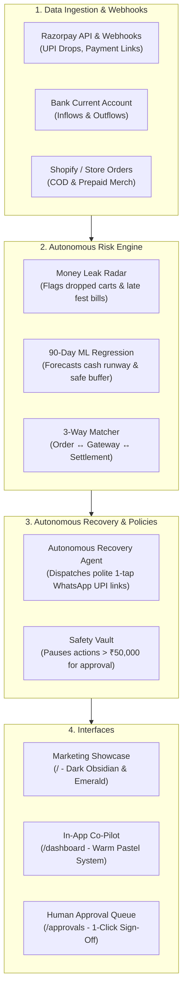

# CashPulse AI ⚡
### Autonomous Liquidity & AR Recovery Operating System for Indian SMBs & D2C Brands

[](https://nextjs.org/)
[](https://fastapi.tiangolo.com/)
[](https://python.org/)
[](https://tailwindcss.com/)
[](https://www.docker.com/)
[](LICENSE)

> **"Stop chasing money. Let stuck cash recover itself."**  
> CashPulse AI is an autonomous financial co-pilot and revenue recovery layer built for Indian D2C merchandise brands, creative agencies, and fast-growing small businesses. It diagnoses payment leaks, rescues dropped UPI checkouts, collects overdue invoices via zero-friction WhatsApp links, and guarantees you never hit a payroll surprise.

---

## 🌟 Two Distinct Design Systems

CashPulse AI features two unified visual zones designed specifically for their distinct contexts:

| Zone | Route | Aesthetic | Palette | Key Highlights |
| :--- | :--- | :--- | :--- | :--- |
| **Zone 1: Marketing Showcase** | `/` | Ultra-modern dark fintech (Stripe/Linear/Ramp grade) | Deep Obsidian (`#08090C`, `#0E1015`), Electric Emerald (`#00F59B`), Cyan glow | Custom peeking 3D liquidity artwork, 3D mouse-tracking tilt card, real-time recovery ticker, interactive live ROI recovery calculator, tabbed product tour. |
| **Zone 2: In-App Financial Co-Pilot** | `/dashboard`, `/receivables`, `/cashflow`, etc. | Human, warm fintech (Mercury/Pigment style) | Warm Cream (`#FAF9F6`), Charcoal black (`#141312`), Sage green, Honey amber, Peach coral | Tactile `warm-card` containers, shopkeeper plain-language explanations, zero terminal jargon, global `Cmd+K` command bar, instant navigation back to the marketing site. |

---

## 🛍️ Live Simulated Business: द्वीSakhi (DwiSakhi)

The entire application runs on a coherent, mathematically reconciled dataset simulating **द्वीSakhi** — a Gen-Z D2C merchandise brand run by young founders **Neha & Khushi** in Delhi NCR:

* **Catalogue**: Cotton canvas tote bags, corduroy bucket hats, embroidered graphic caps, zippered pouches, and DTF sticker packs.
* **Customer Roster**: 180+ college student retail buyers across 12 Indian cities, alongside seasonal bulk merchandise orders for top college festivals:
  * **Mood Indigo IIT Bombay** (`₹54,000` — 150x Embroidered Caps & Stickers, 8 days overdue)
  * **Malhar St. Xavier's Mumbai** (`₹36,000` — 120x Aesthetic Canvas Totes, 4 days overdue)
  * **Sympulse Symbiosis Pune** (`₹64,000` — 200x Custom Event Totes)
  * **Waves BITS Pilani Goa** (`₹28,000` — 80x Vintage Corduroy Bucket Hats)
  * **Rotaract Youth Conclave** (`₹18,000` — 60x Corduroy Pouches)
* **Mathematical Reconciliation**: Every number across every route reconciles to the exact same rupee total:
  * **Cash in Bank**: `₹3,16,188` (70 days safety runway)
  * **Outstanding Receivables**: `₹2,02,580`
  * **Recovered This Month**: `₹32,000` (Settled via automated WhatsApp link)
  * **Daily Burn Rate**: `₹4,500/day` (Shahpur Jat studio rent, Tirupur fabric blanks, DTF printing, logistics)
* **Human Safety Guardrails**: High-ticket fest orders exceeding Neha & Khushi's safety threshold (`>₹50,000`) automatically pause in the **Waiting For Your Approval** queue (`/approvals`) for 1-click manual sign-off.

---

## 🏛️ System Architecture & Data Flow



---

## 🗺️ Application Route Sitemap

| Route | Page Name | Purpose |
| :--- | :--- | :--- |
| `/` | **Marketing Showcase** | High-voltage landing page with 3D tilt hero, live recovery calculator, live ticker, and DwiSakhi spotlight. |
| `/onboarding` | **Guided Business Setup** | 3-step setup pre-filled with DwiSakhi credentials, persisting to SQLite via live REST API. |
| `/dashboard` | **Cash Cockpit** | Answers the 4 daily shopkeeper questions, live metrics sync, and daily LLM brief. |
| `/receivables` | **Who Owes You Money** | Ledger of all unpaid customer & fest accounts summing to `₹2,02,580`. |
| `/recovery` | **Recovery Pipeline** | Kanban tracking recovered vs pending cases with zero-awkwardness indicators. |
| `/recovery/[id]` | **Recovery Dossier** | Deep-dive case file with WhatsApp transcript, 1-tap payment link, and audit history. |
| `/cashflow` | **How Long Will Cash Last?** | 90-day predictive regression chart with expected, optimistic, and stressed bounds. |
| `/scenarios` | **What-If Money Gets Tight?** | Interactive late payment slider calculating real-time cash cushion impact. |
| `/approvals` | **Waiting For Your Approval** | Safety queue where actions over `₹50,000` (e.g. Mood Indigo ₹54k) wait for human approval. |
| `/audit` | **History of Everything Done** | Transparent event log recording autonomous recoveries and approvals. |
| `/reconciliation` | **Money Leak Detective** | 3-way match tracing orders from customer checkout to bank settlement. |
| `/settings` | **What CashPulse Can Do** | Configurable boundaries: retry limits, reminder frequency, and approval threshold. |
| `/pay/simulate` | **Customer Payment Portal** | Simulated Razorpay checkout sandbox triggering live webhook settlement events. |

---

## ⚡ Quick Start & Local Setup

### 1. Prerequisites
* **Python**: `3.10` or `3.11+`
* **Node.js**: `18.18+` or `20+`
* **Package Managers**: `pip` and `npm`

### 2. Clone and Configure
```bash
git clone https://github.com/khushikakade/CashPulse-AI.git
cd CashPulse-AI

# Create root environment file
cp .env.example .env
```

### 3. Run Backend Server (FastAPI)
```bash
# In first terminal:
cd backend
pip install -r requirements.txt

# Reset / seed DwiSakhi simulation database (optional)
python -m backend.scripts.seed_dwisakhi

# Launch development server
python -m uvicorn backend.app.main:app --host 127.0.0.1 --port 8000 --reload
```
API runs on `http://127.0.0.1:8000`. Interactive OpenAPI documentation available at `http://127.0.0.1:8000/docs`.

### 4. Run Frontend Server (Next.js)
```bash
# In second terminal:
cd frontend
npm install
npm run dev
```
Open `http://localhost:3000` to explore the marketing showcase and click **"Open द्वीSakhi"** to access the dashboard.

---

## 🐳 Docker Deployment

Run the entire CashPulse stack in isolated production containers using Docker Compose:

```bash
# Build and start both containers with health checks
docker-compose up -d --build

# Inspect container status
docker-compose ps

# View backend & frontend logs
docker-compose logs -f
```

* **Frontend**: `http://localhost:3000`
* **Backend API**: `http://localhost:8000`
* **Database**: Persisted locally in `./cashpulse.db`

To shut down:
```bash
docker-compose down
```

---

## ☁️ Cloud Deployment Guidelines

### Frontend (Vercel)
1. Import repository on [Vercel](https://vercel.com).
2. Set Root Directory to `frontend`.
3. Set Environment Variable:
   * `NEXT_PUBLIC_API_URL`: Your deployed backend URL (e.g. `https://api.cashpulse.in/api/v1`).
4. Deploy!

### Backend (Render / Railway / Fly.io)
1. Deploy from the repository root using `backend/Dockerfile` or native Python runtime.
2. Build Command: `pip install -r backend/requirements.txt`
3. Start Command: `python -m uvicorn backend.app.main:app --host 0.0.0.0 --port 8000`
4. Set Environment Variables:
   * `DATABASE_URL`: SQLite or PostgreSQL connection string
   * `ENVIRONMENT`: `production`
   * `LLM_PROVIDER`: `mock` (or `gemini` / `openai` with corresponding API key)
   * `RAZORPAY_KEY_ID`: Your Razorpay Key ID
   * `RAZORPAY_KEY_SECRET`: Your Razorpay Key Secret
   * `RAZORPAY_WEBHOOK_SECRET`: Your Razorpay Webhook Secret

---

## 🧪 Automated Testing

Run the backend Pytest suite to verify mathematical reconciliation, the ML regression forecast, and bounded safety policies:

```bash
python -m pytest backend/tests -v
```

Validate the Next.js static production bundle and TypeScript types across all 15 routes:

```bash
cd frontend
npm run build
```

---

## 🔒 Security & Privacy

* **Zero Direct Debits**: CashPulse never initiates unconfirmed debits; all customer collections use standard one-tap UPI payment links.
* **Bounded Safety Limits**: Actions exceeding configurable thresholds (default `₹50,000`) hard-stop and await founder approval.
* **256-Bit Webhook Signature Verification**: All Razorpay inbound payment events are validated via HMAC-SHA256 signature checking.
* **Granular Audit Logs**: Every automated trigger, dispatched message, and user decision is permanently logged to an append-only audit ledger.

---

## 📄 License

Distributed under the MIT License. See [LICENSE](LICENSE) for details.
