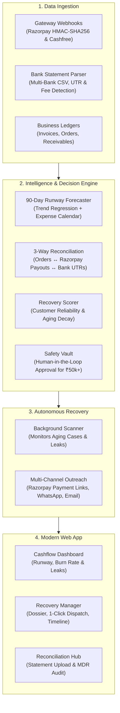
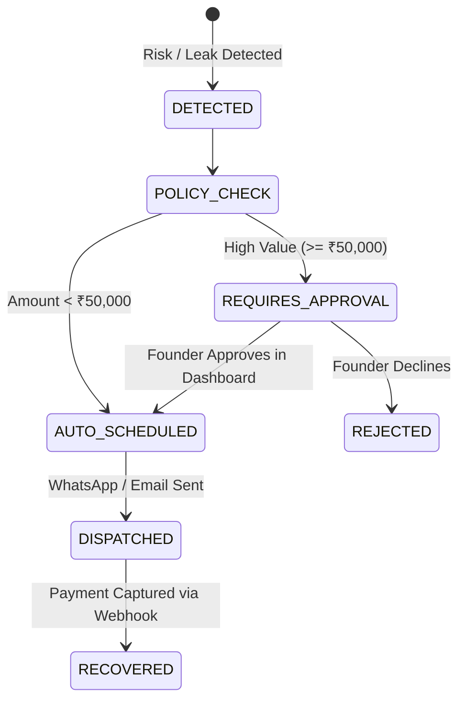

# CashPulse AI ⚡
### Autonomous Cashflow Intelligence, Payment Recovery & 3-Way Bank Reconciliation

[](https://nextjs.org/)
[](https://fastapi.tiangolo.com/)
[](https://python.org/)
[](https://razorpay.com)
[](https://tailwindcss.com/)
[](https://www.docker.com/)
[](LICENSE)

---

## 📌 What is CashPulse AI?

Growing businesses, D2C brands, and MSMEs lose **3% to 5% of their revenue** each month to silent financial leaks: dropped online checkouts, forgotten B2B invoices, and hidden payment gateway deductions.

**CashPulse AI** acts as an autonomous financial co-pilot that watches your cash flow 24/7, recovers lost payments automatically, and ensures your bank account matches your books down to the last rupee.

```
┌───────────────────────────┐      ┌───────────────────────────┐      ┌───────────────────────────┐
│     1. Catch Leaks        │      │    2. Recover Payments    │      │    3. Match the Money     │
│ Dropped checkouts, unpaid │ ───► │ 1-click Razorpay links on │ ───► │ 3-way bank statement      │
│ invoices & cash crunches  │      │ WhatsApp & Email with AI  │      │ reconciliation & MDR audit│
└───────────────────────────┘      └───────────────────────────┘      └───────────────────────────┘
```

### The 4 Core Superpowers:
1. 💸 **Stop Cash Leaks**: Catches dropped customer checkouts and overdue invoices the moment they happen.
2. 📲 **Automate Payment Recovery**: Generates dynamic, 1-click Razorpay UPI payment links and sends personalized WhatsApp & Email reminders.
3. 📈 **90-Day Cashflow Runway**: Predicts future cash positions and burn rate using time-series forecasting so you never get surprised before payroll.
4. 🔍 **3-Way Bank Reconciliation**: Automatically matches bank statement CSVs (HDFC, ICICI, SBI, Axis) against Razorpay payouts and customer orders to catch missing deposits and hidden fee deductions (MDR).

---

## ⏱️ 3-Minute Quick Demo for Evaluators

Want to see CashPulse AI in action? You can run the entire loop locally in under 3 minutes:

1. **Check the Financial Cockpit (`/dashboard` & `/cashflow`)**:
   - See your live cash in bank, daily burn rate, and 90-day predictive runway.
2. **Review a Recovery Case (`/recovery`)**:
   - Open any pending recovery case (`/recovery/[id]`). View the AI recovery likelihood score, root cause breakdown, and click **"Send via WhatsApp"** or **"Copy Payment Link"** to view the generated Razorpay link.
3. **Simulate a Live Settlement (`/pay/simulate`)**:
   - Open the payment simulator, complete a mock 1-tap checkout, and watch the verified Razorpay webhook mark the invoice as **Recovered** in real time!
4. **Audit Bank Statement UTRs (`/reconciliation`)**:
   - Click **"Load Sample HDFC Statement"** to parse real transaction lines, match UTR numbers, and catch gateway MDR fee deductions.

---

## 🏛️ How It Works (Architecture)



---

## ⚡ Razorpay Integration Highlights

CashPulse AI is built to make the most of the **Razorpay developer platform**:

```
[Dropped Checkout / Overdue Invoice]
           │
           ▼
 [Razorpay Payment Links API]  ───(Dynamic UPI Link + Reminders)──►  [Customer WhatsApp / Email]
           │                                                                    │
           ▼                                                                    ▼
 [HMAC-SHA256 Webhook Pipeline] ◄───(payment.captured / payment.failed)──── [Customer Pays]
           │
           ▼
 [3-Way Bank Reconciler] ◄───(Matches Bank Statement UTR + Audits MDR Fees)
```

* **Dynamic Payment Links (`/v1/payment_links`)**:
  - Automatically creates single-use Razorpay payment links with custom expiry and UPI support.
  - Generates ready-to-send WhatsApp deep links (`https://wa.me`) and professional email notifications.
* **Secure Webhook Pipeline (`X-Razorpay-Signature`)**:
  - Real-time event listener for `payment.captured`, `payment.failed`, and `payment_link.paid`.
  - Cryptographically verified using **HMAC-SHA256** signatures with database-level idempotency to prevent duplicate processing.
* **MDR Fee Auditing & UTR Matching**:
  - Solves the common mystery of "why did I receive less money in the bank than the customer paid?".
  - Matches Razorpay settlement batches against bank statement UTR entries and audits exact Merchant Discount Rate (MDR) deductions (e.g. 2% + GST).
* **Interactive Test Simulator (`/pay/simulate`)**:
  - Lets you test the full payment lifecycle (payment success, failure, webhook callbacks) without needing live banking credentials.

---

## 🧠 Smart Forecasting & Scoring Logic

CashPulse AI keeps financial intelligence practical, transparent, and explainable:

### 1. 90-Day Cash Runway Forecast
Instead of guessing when cash might run low, CashPulse models future cash positions by combining:
- **Historical Cash Velocity**: Daily trend line calculated from past inflows and outflows.
- **Scheduled Obligations**: Hard upcoming expenses (payroll, commercial rent, vendor invoices, tax remittances).
- **Uncertainty Envelope**: Widening confidence bands ($P_{10}$ stressed scenario vs. $P_{90}$ optimistic scenario) to give founders clear best-case and worst-case visibility.

<details>
<summary><b>📐 View Mathematical Formulation</b></summary>

$$\hat{C}(t) = C_0 + \beta \cdot t - \sum_{k} O_k(t) \pm \alpha \cdot \sigma_0 \sqrt{t}$$

- $C_0$: Current reconciled bank balance.
- $\beta$: Daily net cash velocity (ordinary least squares regression slope).
- $O_k(t)$: Fixed scheduled obligations on day $t$.
- $\alpha \cdot \sigma_0 \sqrt{t}$: Stochastic volatility cone widening over projection horizon $t$.
</details>

---

### 2. Smart Recovery Probability Score ($P_{\text{recovery}}$)
Every unpaid invoice and dropped cart receives a probability score (from 2% to 99%) that determines the best recovery strategy:
- **Customer Reliability**: Tracks past on-time payment behavior. Good payers get gentle nudges; serial late-payers get firmer escalations.
- **Ticket Size Impact**: High-value orders (> ₹50,000) typically require multi-tier business approvals and are adjusted accordingly.
- **Aging Decay**: Invoices decay in recovery likelihood the older they get, prioritizing urgent action on recent drops.

<details>
<summary><b>📐 View Mathematical Formulation</b></summary>

$$P_{\text{recovery}} = S_{\text{rel}} \times \delta_{\text{ticket}} \times \gamma_{\text{decay}}$$

- **Reliability Index ($S_{\text{rel}}$)**: `(Settled Invoices / Total Invoices) * (1 - Avg Delay / 60)`
- **Ticket Adjustment ($\delta_{\text{ticket}}$)**: 0.90 for > ₹50k, 0.85 for > ₹100k, 1.00 otherwise.
- **Aging Decay ($\gamma_{\text{decay}}$)**: Exponential decay per overdue interval or retry attempt.
</details>

---

### 3. Anomaly Detection
Uses an **Isolation Forest** machine learning model to flag suspicious transactions based on unusual amounts and atypical hours of the day, helping teams catch routing anomalies or potential fraud early.

---

## 🔄 3-Way Bank Reconciliation Explained

Most finance teams manually spend hours comparing spreadsheets. CashPulse AI automates this 3-way check:

```
[Customer Order / ERP Invoice] ◄──► [Razorpay Settlement Batch] ◄──► [Bank Statement UTR Narration]
```

- **Smart UTR Extraction**: Automatically parses bank narrations from **HDFC, ICICI, SBI, Axis Bank**, and standard CSV exports using pattern extractors (`UPI`, `NEFT`, `RTGS`, `IMPS`, `CMS`).
- **MDR Fee Variance Audit**: Calculates the exact difference between what was billed and what reached the bank account:
  $$\Delta_{\text{Fee}} = \text{Invoice Amount} - \text{Net Bank Credit}$$
- **Clear Status Flags**: Marks every item clearly as `MATCHED`, `MDR_FEE_VARIANCE`, or `PENDING_SETTLEMENT`.

---

## 🛡️ Safety Vault & Human-in-the-Loop Controls

Automation should never risk customer trust. CashPulse AI enforces strict guardrails before taking action:



### Safety Guardrails at a Glance:
| Guardrail | Setting | Why It Matters |
| :--- | :--- | :--- |
| **High-Value Threshold** | `₹50,000` | Invoices $\ge$ ₹50,000 require manual founder approval in `/approvals` before any outreach is sent. |
| **Spam Prevention** | `24 Hours` | Enforces a minimum 24-hour cool-off period between reminders to prevent annoying customers. |
| **Maximum Retries** | `2 Reminders` | Caps automated outreach attempts before flagging a case for personal executive follow-up. |

---

## 🔌 Key API Endpoints

| Method | Endpoint | What It Does |
| :--- | :--- | :--- |
| `GET` | `/api/v1/dashboard/overview` | Overall health metrics: bank balance, total receivables, money recovered, and runway days. |
| `GET` | `/api/v1/cashflow/forecast` | 90-day time-series projections with expected, lower, and upper cash bounds. |
| `GET` | `/api/v1/recovery/cases` | List of all active recovery cases with recovery scores and status. |
| `GET` | `/api/v1/recovery/cases/{id}` | Detailed case dossier with customer history and payment link options. |
| `POST` | `/api/v1/recovery/{id}/dispatch` | Sends recovery outreach via WhatsApp or Email with the dynamic Razorpay link. |
| `POST` | `/api/v1/reconciliation/upload-statement` | Uploads a bank statement CSV to run the 3-way reconciliation engine. |
| `GET` | `/api/v1/reconciliation/sample-statement` | Downloads synthetic bank statement data for easy testing. |
| `POST` | `/api/v1/webhooks/razorpay` | Ingests real-time Razorpay webhook events with HMAC-SHA256 signature verification. |
| `POST` | `/api/v1/scanner/trigger` | Triggers an on-demand scan across all invoices and transactions. |

---

## 💻 Tech Stack

- **Frontend**: Next.js 16 (App Router, React 19, TypeScript, Tailwind CSS v4, Lucide Icons, Recharts).
- **Backend**: FastAPI (Python 3.11+, async architecture, Pydantic v2, SQLAlchemy 2.0).
- **Payments**: Razorpay Payment Links API & HMAC-SHA256 Webhooks (with Cashfree support).
- **Data & ML**: Pandas, NumPy, Scikit-Learn (Linear Regression & Isolation Forest).
- **Database**: SQLite (zero-config local setup) / PostgreSQL compatible for production.
- **DevOps**: Docker & Docker Compose with multi-stage builds.

---

## 🚀 Quick Start & Local Setup

### 1. Clone & Configure
```bash
git clone https://github.com/khushikakade/CashPulse-AI.git
cd CashPulse-AI

# Create your local environment file
cp .env.example .env
```

### 2. Start the Backend (FastAPI)
```bash
cd backend
python -m pip install --upgrade pip
pip install -r requirements.txt

# Seed the database with demo business data
python -m backend.scripts.seed_dwisakhi

# Launch the FastAPI dev server
python -m uvicorn backend.app.main:app --host 127.0.0.1 --port 8000 --reload
```
* 📘 Swagger API Docs: [http://127.0.0.1:8000/docs](http://127.0.0.1:8000/docs)
* 📕 ReDoc: [http://127.0.0.1:8000/redoc](http://127.0.0.1:8000/redoc)

### 3. Start the Frontend (Next.js)
```bash
cd frontend
npm install
npm run dev
```
* 🌐 Web App: [http://localhost:3000](http://localhost:3000)
* 📊 Dashboard: [http://localhost:3000/dashboard](http://localhost:3000/dashboard)

---

## 🐳 Run with Docker

Prefer Docker? You can start the entire frontend, backend, and database with one command:

```bash
docker compose up -d --build
```
* **Frontend**: [http://localhost:3000](http://localhost:3000)
* **Backend API**: [http://localhost:8000](http://localhost:8000)

---

## 🧪 Testing & Verification

Run the test suite to verify reconciliation logic, forecasting, policy vaults, and webhooks:

```bash
# Backend test suite (Pytest)
python -m pytest backend/tests -v

# Frontend production build & type check
cd frontend
npm run build
```

---

## 🔒 Security & Privacy

- **HMAC-SHA256 Webhook Verification**: Ensures all payment notifications strictly originate from Razorpay before any ledger updates occur.
- **Zero Direct Debit Access**: CashPulse AI never initiates automatic deductions from customer bank accounts; collections always occur through authenticated UPI/payment links.
- **Immutable Audit Trail**: All risk detections, outreach dispatches, and manual approvals are permanently recorded in an append-only audit log.
- **Human-in-the-Loop Gating**: High-value recoveries cannot be dispatched autonomously without manual manager sign-off.

---

## 📄 License

Distributed under the MIT License. See [LICENSE](LICENSE) for details.

