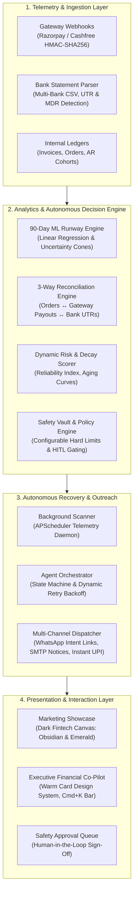
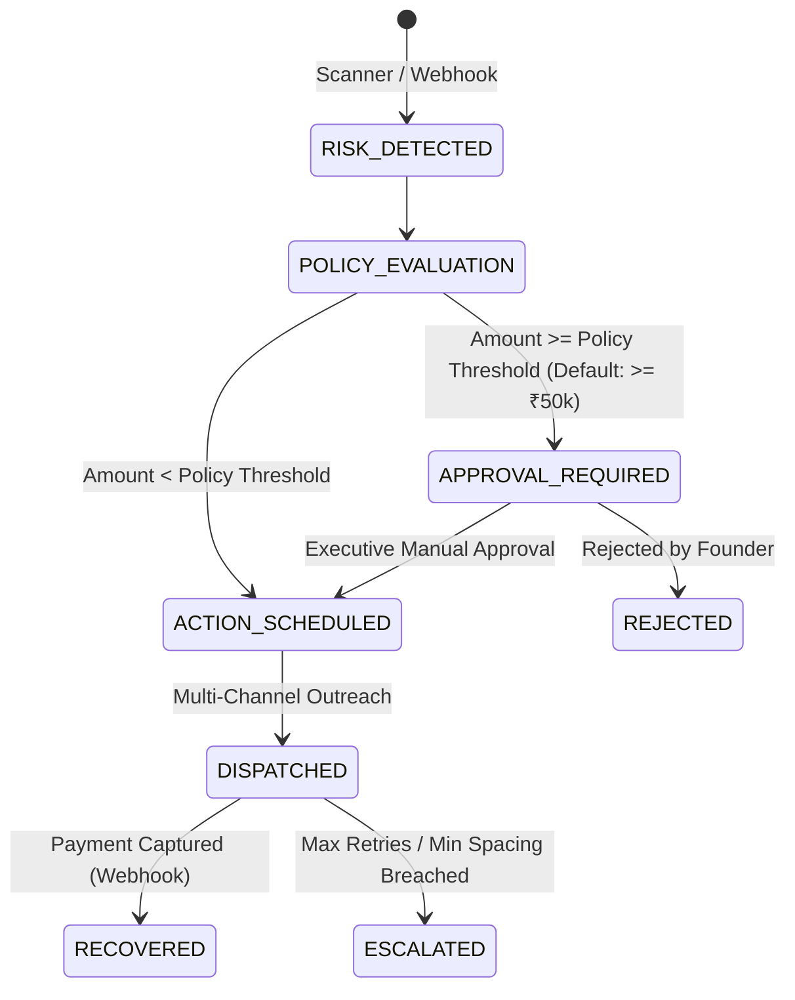

# CashPulse AI ⚡
### Autonomous Liquidity Telemetry, AR Recovery & 3-Way Reconciliation Engine

[](https://nextjs.org/)
[](https://fastapi.tiangolo.com/)
[](https://python.org/)
[](https://tailwindcss.com/)
[](https://www.docker.com/)
[](.github/workflows/deploy.yml)
[](LICENSE)

---

## 📌 Overview

**CashPulse AI** is an enterprise-grade autonomous financial telemetry and revenue recovery operating system built for modern MSMEs, D2C brands, and B2B enterprises. It continuously ingests banking streams, payment gateway webhooks, and enterprise billing ledgers to:

1. **Eliminate Cash Leaks**: Detect dropped checkout transactions and reconcile cross-channel gateway settlements in real time.
2. **Automate Receivables (AR) Recovery**: Trigger policy-bounded, multi-channel recovery workflows (dynamic UPI links, automated email advisories, pre-filled WhatsApp communications) with zero customer friction.
3. **Forecast Liquidity Runway**: Execute 90-day time-series regression and stochastic simulations to detect upcoming working capital shortfalls before payroll or vendor commitments are impacted.
4. **Execute 3-Way Bank Statement Reconciliation**: Audit bank statement CSV exports (HDFC, ICICI, SBI, Axis) against gateway settlements and internal invoices, surfacing hidden Merchant Discount Rate (MDR) deductions and missing UTR deposits.

---

## 🏛️ System Architecture



---

## 🔬 Mathematical & Algorithmic Foundations

### 1. 90-Day Liquidity Runway & Stochastic Forecasting

The predictive cashflow engine calculates daily expected cash positions using linear regression trained over historical cash inflow/outflow vectors, overlaid with fixed upcoming obligations and a square-root temporal dispersion term:

$$\hat{C}(t) = C_0 + \beta \cdot t - \sum_{k} O_k(t) \pm \alpha \cdot \sigma_0 \sqrt{t}$$

Where:
* $C_0$: Current reconciled liquid cash in bank accounts.
* $\beta$: Fitted daily cash velocity (slope parameter from Ordinary Least Squares regression over historical daily delta distributions).
* $O_k(t)$: Deterministic scheduled obligations occurring on day $t$ (e.g. payroll cycles, tax remittances, recurring commercial rent).
* $\alpha \cdot \sigma_0 \sqrt{t}$: Stochastic volatility envelope widening with projection horizon $t$, reflecting confidence bounds ($P_{10}$ stressed scenario to $P_{90}$ optimistic scenario).
* **Cash Runway Metric**: $R = \frac{C_0}{\text{Daily Burn Rate}}$, where $\text{Daily Burn Rate} = \frac{1}{N} \sum_{i=1}^N \text{Outflows}_i$.

### 2. Dynamic Receivables Recovery Probability Scoring

Every overdue invoice and dropped checkout is evaluated via a probabilistic score $P_{\text{recovery}} \in [0.02, 0.99]$:

$$P_{\text{recovery}} = S_{\text{rel}} \times \delta_{\text{ticket}} \times \gamma_{\text{decay}}$$

* **Customer Reliability Index ($S_{\text{rel}}$)**: Historical fulfillment ratio derived from prior payment settlements:
  $$S_{\text{rel}} = \frac{\text{Settled Invoices}}{\text{Total Invoices}} \times \left(1 - \frac{\text{Avg Delay Days}}{60}\right)$$
* **High-Ticket Adjustment ($\delta_{\text{ticket}}$)**:
  $$\delta_{\text{ticket}} = \begin{cases} 0.90 & \text{if Amount} > \text{₹}50,000 \\ 0.85 & \text{if Amount} > \text{₹}1,00,000 \\ 1.00 & \text{otherwise} \end{cases}$$
* **Temporal Aging Decay ($\gamma_{\text{decay}}$)**:
  * For dropped gateway checkouts with retry count $k$: $\gamma_{\text{decay}} = (0.75)^k$
  * For aging enterprise invoices with overdue days $d$: $\gamma_{\text{decay}} = (0.92)^{(d / 5.0)}$ (exponential half-life decay every 5 days).

### 3. Unsupervised Anomaly Detection

Transaction cohorts are evaluated in real time using an **Isolation Forest** ensemble ($N_{\text{estimators}} = 100$, contamination $\approx 0.10$) over bivariate feature vectors $\mathbf{x} = [\text{Amount}, \text{HourOfDay}]$. Anomalous payments falling into sparse isolation partitions are flagged immediately for fraud or routing leakage review.

---

## 🔄 3-Way Bank Statement Reconciliation Engine

The reconciliation module ingests raw bank CSV statements (supporting HDFC, ICICI, SBI, Axis Bank, and generic ASCII formats) and performs automated three-way matching against internal order ledgers and payment gateway batch settlements:

```
[Customer Order / ERP Invoice] <---> [Payment Gateway Settlement ID] <---> [Bank Statement UTR Narration]
```

### Feature Breakdown:
* **UTR Normalization & Regex Extraction**: Automatically parses bank transaction narrations using structured patterns:
  ```python
  re.search(r"(?:INF|UPI|NEFT|RTGS|IMPS|CMS)[/-]?([A-Z0-9]{12,22})", narration, re.IGNORECASE)
  ```
* **MDR Fee Audit**: Detects hidden Merchant Discount Rate (MDR) deductions by comparing expected gross settlements against actual net credits deposited into the current account:
  $$\Delta_{\text{MDR}} = \text{Gross Invoice / Payout Amount} - \text{Net Bank Credit Amount}$$
* **Audit Trail Integration**: Flags unreconciled items with granular status codes (`MATCHED`, `GATEWAY_ESCROW_PENDING`, `MDR_FEE_VARIANCE`, `DROPPED_CHECKOUT`).

---

## 🛡️ Autonomous State Machine & Policy Vault

All automated recovery initiatives are governed by an immutable **Policy Vault** enforcing strict Human-in-the-Loop (HITL) safety boundaries:



### Policy Guardrail Settings
| Configuration Key | Type | Default Value | Description |
| :--- | :--- | :--- | :--- |
| `HIGH_VALUE_THRESHOLD` | `float` | `50000.00` | Any recovery action at or above this rupee threshold requires manual executive approval in `/approvals`. |
| `MAX_PAYMENT_RETRIES` | `int` | `2` | Maximum autonomous payment link generation attempts permitted per dropped checkout case. |
| `MAX_AUTOMATED_REMINDERS`| `int` | `2` | Maximum reminder notices dispatched to a customer before escalating to manual relationship handling. |
| `MIN_HOURS_BETWEEN_REMINDERS` | `int` | `24` | Strict rate-limiting window preventing customer fatigue or spamming. |

---

## 🗄️ Relational Database Schema

The core persistence tier is managed via **SQLAlchemy ORM** with SQLite for local development and PostgreSQL compatibility for production:

```
┌─────────────────┐       ┌─────────────────┐       ┌──────────────────┐
│   businesses    │──1:N─<│    customers    │──1:N─<│      orders      │
└─────────────────┘       └─────────────────┘       └──────────────────┘
         │                         │                          │
        1:N                       1:N                        1:N
         │                         │                          │
┌─────────────────┐       ┌─────────────────┐       ┌──────────────────┐
│   cash_events   │       │    invoices     │       │     payments     │
└─────────────────┘       └─────────────────┘       └──────────────────┘
                                   │                          │
                                  1:N                        1:N
                                   └───────────┬──────────────┘
                                               │
                                              1:N
                                               ▼
                                  ┌─────────────────────────┐
                                  │     recovery_cases      │
                                  └─────────────────────────┘
                                               │
                                              1:N
                                               ▼
                                  ┌─────────────────────────┐
                                  │    recovery_actions     │
                                  └─────────────────────────┘
                                               │
                                              1:N
                                               ▼
                                  ┌─────────────────────────┐
                                  │       audit_logs        │
                                  └─────────────────────────┘
```

* **`webhook_events`**: Stores incoming payloads with `signature_valid` (`BOOLEAN`), `processing_attempts`, and unique constraints ensuring strict deduplication and replay attack prevention.
* **`audit_logs`**: Append-only ledger recording timestamped traces of every detected risk, policy gate, dispatched message, and user override.

---

## 🔌 Core API Specifications

| Method | Endpoint | Description |
| :--- | :--- | :--- |
| `GET` | `/api/v1/dashboard/overview` | Returns aggregate financial health telemetry: Cash in Bank, Total Receivables, Recovered MTD, and Safety Runway. |
| `GET` | `/api/v1/cashflow/forecast` | Returns 90-day time-series projections containing `expected`, `lower_bound`, and `upper_bound` cash positions. |
| `GET` | `/api/v1/recovery/cases` | Retrieves the real-time recovery case pipeline with risk scores and probability metrics. |
| `GET` | `/api/v1/recovery/cases/{id}` | Deep-dive case inspection including customer contact, payment links, and action history. |
| `POST` | `/api/v1/recovery/{id}/dispatch` | Dispatches recovery outreach (`channel`: `"whatsapp"` \| `"email"`) with pre-filled payment link. |
| `POST` | `/api/v1/reconciliation/upload-statement` | Multipart CSV upload endpoint executing 3-way UTR extraction and MDR fee audit. |
| `GET` | `/api/v1/reconciliation/sample-statement` | Returns synthetic multi-bank statement CSV for test execution and benchmarking. |
| `POST` | `/api/v1/webhooks/razorpay` | Validates HMAC-SHA256 signature and ingests real-time `payment.captured` and `payment.failed` events. |
| `POST` | `/api/v1/webhooks/cashfree` | Ingests Cashfree payment gateway webhook payloads with cryptographic signature validation. |
| `GET` | `/api/v1/scanner/status` | Reports real-time status of the asynchronous background telemetry scanner daemon. |
| `POST` | `/api/v1/scanner/trigger` | Triggers immediate asynchronous scan across all aging invoices and dropped transactions. |

---

## 💻 Tech Stack & Tooling

* **Frontend**: Next.js 16 (App Router, Turbopack, React 19, TypeScript 5, Tailwind CSS v4, Lucide Icons, Recharts).
* **Backend**: FastAPI (Python 3.11+, ASGI asynchronous concurrency, Pydantic v2 validation, SQLAlchemy 2.0).
* **Data Science & ML**: NumPy, Pandas, Scikit-Learn (Linear Regression, Isolation Forest).
* **Background Scheduler**: Asyncio background task engine and APScheduler.
* **CI/CD & DevOps**: GitHub Actions Matrix, Docker Compose multi-stage containerization (`node:20-alpine`, `python:3.11-slim`).

---

## ⚡ Quick Start & Local Setup

### 1. Environment Setup
```bash
git clone https://github.com/khushikakade/CashPulse-AI.git
cd CashPulse-AI

# Create root environment configuration
cp .env.example .env
```

### 2. Launch Backend Service (FastAPI)
```bash
cd backend
python -m pip install --upgrade pip
pip install -r requirements.txt

# Populate database with reconciled baseline financial dataset & accounts
python -m backend.scripts.seed_dwisakhi

# Run development server with hot reload
python -m uvicorn backend.app.main:app --host 127.0.0.1 --port 8000 --reload
```
* Interactive OpenAPI Swagger docs: `http://127.0.0.1:8000/docs`
* ReDoc technical specification: `http://127.0.0.1:8000/redoc`

### 3. Launch Frontend Service (Next.js)
```bash
cd frontend
npm ci || npm install
npm run dev
```
* Application landing & marketing showcase: `http://localhost:3000`
* In-app cash flow cockpit: `http://localhost:3000/dashboard`

---

## 🐳 Docker Deployment

The stack is containerized with multi-stage production builds and automatic healthcheck probes:

```bash
# Build and orchestrate both services
docker compose up -d --build

# Verify container health
docker compose ps

# Follow container logs
docker compose logs -f
```

* **Frontend Web App**: `http://localhost:3000`
* **Backend REST API**: `http://localhost:8000`
* **Persistent Database**: Bind-mounted locally in `./cashpulse.db`

---

## 🧪 Verification & Automated Testing

### Backend Test Suite (Pytest)
Executes comprehensive unit and integration tests covering reconciliation mathematics, regression forecasting, policy vault gating, and webhook signature verification:

```bash
python -m pytest backend/tests -v
```

### Frontend Typecheck & Production Compilation
Validates full TypeScript safety and executes static optimization across all 15 routes:

```bash
cd frontend
npm run build
```

---

## 🔒 Security Architecture

* **Cryptographic Webhook Verification**: All incoming webhooks are validated using HMAC-SHA256 signature verification matching raw request payloads against `RAZORPAY_WEBHOOK_SECRET` and `CASHFREE_WEBHOOK_SECRET`.
* **Zero Direct Debit Access**: The system never initiates unverified customer debits; collections operate via verified one-tap UPI intent links or dynamic hosted gateway checkouts.
* **Append-Only Event Ledger**: Critical actions, policy modifications, and executive approvals write immutable entries to `audit_logs`.
* **Human-in-the-Loop Gating**: Transactions exceeding `HIGH_VALUE_THRESHOLD` (default ₹50,000) are hard-paused in state `APPROVAL_REQUIRED` until an authenticated administrator manually confirms or rejects the action.

---

## 📄 License

Distributed under the MIT License. See [LICENSE](LICENSE) for details.
