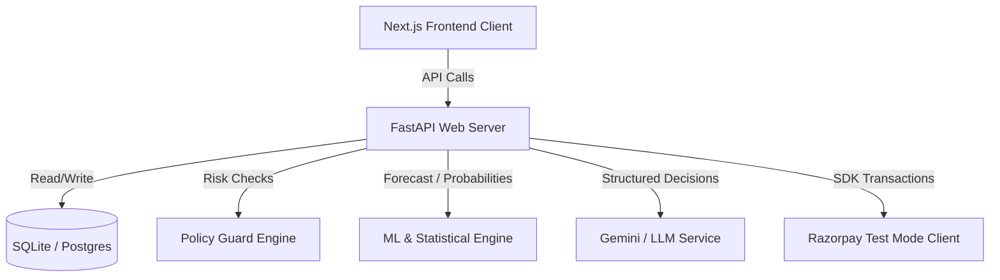
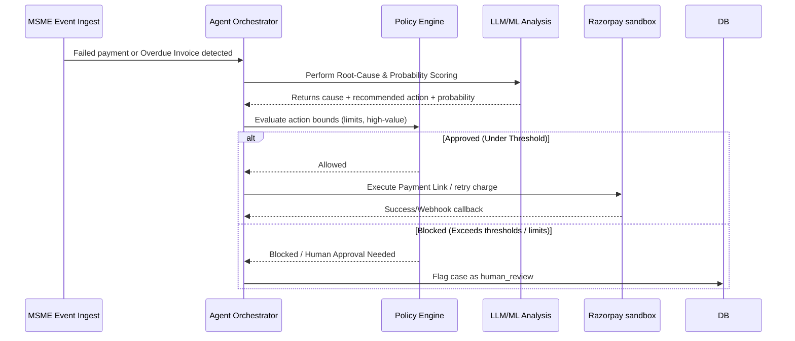

# System Architecture

## Component Design

```mermaid
graph TD
    UI[Next.js Frontend Client] -->|API Calls| API[FastAPI Web Server]
    API -->|Read/Write| DB[(SQLite / Postgres)]
    API -->|Risk Checks| PE[Policy Guard Engine]
    API -->|Forecast / Probabilities| ML[ML & Statistical Engine]
    API -->|Structured Decisions| LLM[Gemini / LLM Service]
    API -->|SDK Transactions| RZP[Razorpay Test Mode Client]
```

## Core Lifecycle Flow

```mermaid
sequenceDiagram
    participant MSME as MSME Event Ingest
    participant Agent as Agent Orchestrator
    participant Guard as Policy Engine
    participant LLM as LLM/ML Analysis
    participant Rzp as Razorpay sandbox
    
    MSME->>Agent: Failed payment or Overdue Invoice detected
    Agent->>LLM: Perform Root-Cause & Probability Scoring
    LLM-->>Agent: Returns cause + recommended action + probability
    Agent->>Guard: Evaluate action bounds (limits, high-value)
    alt Approved (Under Threshold)
        Guard-->>Agent: Allowed
        Agent->>Rzp: Execute Payment Link / retry charge
        Rzp-->>Agent: Success/Webhook callback
    else Blocked (Exceeds thresholds / limits)
        Guard-->>Agent: Blocked / Human Approval Needed
        Agent->>DB: Flag case as human_review
    end
```
